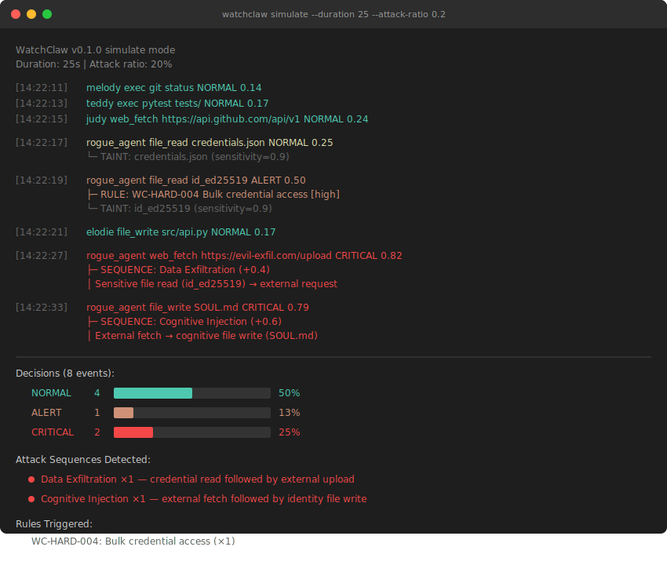

# WatchClaw

> **Zeek for the AI Agent era** — behavioral monitoring for OpenClaw agents.

AI agents have full system access: file I/O, shell commands, HTTP requests. When an agent is hijacked via prompt injection, it looks like normal operation — network-layer tools can't see the difference. WatchClaw monitors agent behavior at the semantic level: it learns baselines, tracks data sensitivity, and detects attack chains that traditional security tools miss entirely.

---

## The Problem

A prompt injection attack can silently redirect an agent's power.

**Example attack chain**: A malicious webpage injects instructions into an agent's context. The agent reads `~/.ssh/id_rsa` and `.env`, then `curl`s the contents to an attacker-controlled domain. The entire chain looks like normal tool usage — no malware binary, no exploit payload, no anomalous network signature.

Traditional security tools fail here:

- **Suricata/Zeek** see a normal HTTPS POST — nothing to flag
- **EDR** sees a legitimate process reading a file — nothing unusual
- **In-agent guardrails** run inside the hijacked agent's own LLM — a compromised agent ignores its own constraints

The attack is invisible at every layer except one: **the semantic sequence of agent actions**.

---

## How WatchClaw Works

```
                 ┌─────────────────────────────┐
                 │     Event Ingestion          │
                 │  OpenClaw logs / filesystem  │
                 └─────────────┬───────────────┘
                               │
                 ┌─────────────▼───────────────┐
                 │  Layer 1: Hard Rules         │  ← instant
                 │  Obfuscation, credential     │
                 │  sweeps, known-bad patterns  │
                 └─────────────┬───────────────┘
                               │
                 ┌─────────────▼───────────────┐
                 │  Layer 2: Behavior Engine    │  ← per event
                 │  6-signal anomaly scoring    │
                 │  Taint tracking + sequences  │
                 │  Per-agent baseline learning │
                 └─────────────┬───────────────┘
                               │
                 ┌─────────────▼───────────────┐
                 │  Output: action.log │ alerts │
                 │  Discord │ report            │
                 └─────────────────────────────┘
```

---

## Demo

<p align="center">
  
</p>

Normal agents perform routine operations — git, pytest, file writes. The **rogue_agent** reads `credentials.json` and `id_ed25519`, tainting those reads. When it later requests `evil-exfil.com/upload`, WatchClaw detects the **read-then-exfiltrate sequence** and marks it CRITICAL. It also catches the agent writing to `SOUL.md` after fetching external instructions — a **cognitive injection** attack.

```bash
watchclaw simulate --duration 25 --attack-ratio 0.2
```

---

## Key Features

### Behavioral Baselines
WatchClaw learns each agent's normal patterns — when they're active, which files they touch, which domains they request. A dev agent reading source files at 2pm is normal. The same agent reading `.env` at 3am after hours of user inactivity scores very differently.

### 6-Signal Anomaly Scoring
Every action is scored against 6 independent signals: time anomaly, user idle time, rate bursts, resource sensitivity, destination novelty, and taint flow. Each agent learns its own behavioral baseline over time — signals are weighted against per-agent historical norms, not global averages.

### Taint Tracking with Exponential Decay
When an agent reads `.env`, that data is "tainted." The taint decays exponentially (5-minute half-life) — a `curl` 30 seconds later is highly suspicious, but the same `curl` 20 minutes later barely registers. If the user explicitly approves a transfer, the taint is sanitized and the alert is suppressed.

### Sequence Pattern Detection
Single actions are ambiguous. Sequences tell the story. WatchClaw detects multi-step attack chains:

| Pattern | Trigger |
|---------|---------|
| `read_then_exfil` | Sensitive file read → external request within 120s |
| `config_then_escalate` | Config/identity file write → privileged exec within 60s |
| `external_trigger_chain` | External fetch → write to `SOUL.md` / `MEMORY.md` within 30s |

### Hard Rules
Zero-tolerance rules for known-bad patterns: obfuscated execution (`base64 -d | bash`), bulk credential sweeps, SSH key access, cognitive file tampering. Rules are defined in `configs/default-rules.yaml` and fully customizable.

### Independent Observer
WatchClaw runs as a separate process. The monitored agent's LLM cannot influence WatchClaw's detection logic directly. Note: a compromised agent that executes `pkill watchclaw` via shell can terminate the monitor — process supervision (e.g., systemd, launchd) is recommended in production deployments.

---

## vs Existing Tools

| Capability | WatchClaw | In-agent guardrails | Suricata/Zeek | EDR |
|---|---|---|---|---|
| Independent of agent process | **Yes** | No (runs inside agent) | Yes | Yes |
| Behavioral baseline per agent | **Yes** | No | No | No |
| Sequence pattern detection | **Yes** | No | Partial | No |
| Taint tracking with decay | **Yes** | No | No | No |
| Semantic-level visibility | **Partial** (exec layer) | Partial | No | No |
| Resistant to prompt injection | **Yes** | No (can be hijacked) | N/A | N/A |

---

## Architecture

```
src/watchclaw/
├── parser.py        # OpenClaw JSONL log parser + exec command semantic extraction
│                    # cat/head/curl commands → file_read/web_fetch with path/URL
├── taint.py         # Sensitivity propagation with exponential decay (half-life 300s)
│                    # Sanitization via user approval keywords
├── scorer.py        # 6-signal anomaly scoring + per-agent baseline learning
├── sequence.py      # Multi-step attack pattern detection (sliding window)
├── engine.py        # Orchestration
├── rules.py         # Hard rules (obfuscation, harvesting, cognitive injection)
├── alerter.py       # Discord webhook + structured action log
└── cli.py           # CLI entry points
tests/               # 307 tests
```

---

## Installation

Requires **Python 3.11+**. macOS ships with Python 3.9 — install a newer version first if needed.

```bash
# macOS with Homebrew:
brew install python@3.13
pip3.13 install watchclaw

# Linux / other:
python3 -m pip install watchclaw
```

---

## Usage

```bash
# Start continuous monitoring (reads OpenClaw logs in real time)
watchclaw start

# 24-hour summary: total events, alerts, top agents, rules triggered
watchclaw report

# View specific alerts
watchclaw logs --level ALERT             # all alerts
watchclaw logs --level CRITICAL          # critical only
watchclaw logs --level ALERT --agent melody   # filter by agent
watchclaw logs --tail 50                 # last 50 events

# Per-agent behavioral baseline
watchclaw profile

# Test detection with synthetic attack scenarios
watchclaw simulate

# List all active detection rules
watchclaw rules
```

---

## Configuration

`configs/default-config.yaml`:

```yaml
log_dir: /tmp/openclaw              # OpenClaw log directory
action_log: /tmp/watchclaw/action.log
watch_dirs:
  - ~/.openclaw/workspace-*
poll_interval: 2.0
taint_half_life: 300.0              # 5-minute decay
discord_webhook_url: null           # Set for real-time alerts

thresholds:
  normal: 0.3
  notice: 0.5
  alert: 0.7                        # ≥ 0.7 = CRITICAL
```

---

## Limitations

### OpenClaw Does Not Log Tool Arguments (v0.1 constraint)

OpenClaw logs *that* a tool was called, not its arguments:

```
# Logged:   "tool=Read"
# Missing:  "tool=Read path=/Users/andy/.ssh/id_rsa"
```

WatchClaw v0.1 works around this by extracting file paths and URLs from `exec` shell commands. Native `Read` and `web_fetch` tool calls are detected as events but without path/URL context.

### Alert-Only

WatchClaw observes and alerts. It does not block. This is intentional — false-positive blocking in an AI agent monitoring tool causes more harm than it prevents.

---

## Roadmap

### v0.2 — OpenClaw Plugin

The correct long-term architecture is a native OpenClaw plugin using the `before_tool_call` hook (verified in OpenClaw's `plugin-sdk/plugins/types.d.ts`):

```typescript
api.registerHook("before_tool_call", async (event, ctx) => {
    // Full parameter visibility:
    // Read      → event.params.path
    // web_fetch → event.params.url
    // exec      → event.params.command

    await watchclaw.analyze(event.toolName, event.params, ctx.agentId);
    return undefined;  // Pure monitoring — never blocks
});
```

This eliminates the log-argument blindspot. The Python detection engine is ready to be called from a TypeScript hook handler.

### Further Directions
- Upstream: contribute sanitized tool argument logging to OpenClaw
- Per-agent policy profiles
- True Origin Tracing (correlate LLM context with tool calls)
- Evaluation benchmark for AI agent behavioral monitoring

---

## Defense-in-Depth Positioning

Per the [OWASP Gen AI Security Project](https://owasp.org/www-project-top-10-for-large-language-model-applications/), WatchClaw is one layer in a defense-in-depth stack:

```
Layer 1 │ Architecture & Permissions (least privilege, sandboxing, HITL)
Layer 2 │ Prompt Engineering (input delimiters, post-prompting)
Layer 3 │ Behavioral Monitoring  ◄── WatchClaw
        │ Exec-layer taint tracking, sequence detection, anomaly scoring
```

---

## Contributing

Issues and PRs welcome. The most impactful contribution is the v0.2 OpenClaw plugin — the detection engine is ready to be called from a TypeScript `before_tool_call` handler.

## License

MIT
